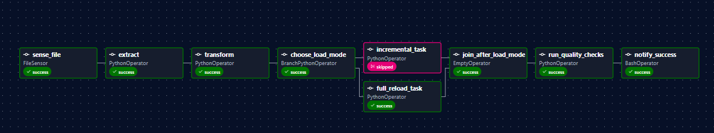

```
[2026-04-23 17:57:10] INFO - DAG bundles loaded: dags-folder
[2026-04-23 17:57:10] INFO - Filling up the DagBag from /opt/airflow/dags/etl_orders_dag.py
[2026-04-23 17:57:10] ERROR - Task failed with exception
RuntimeError: Simulated failure after 2 rows
File "/home/airflow/.local/lib/python3.13/site-packages/airflow/sdk/execution_time/task_runner.py", line 1263 in run
File "/home/airflow/.local/lib/python3.13/site-packages/airflow/sdk/execution_time/task_runner.py", line 1678 in _execute_task
File "/home/airflow/.local/lib/python3.13/site-packages/airflow/sdk/bases/operator.py", line 443 in wrapper
File "/home/airflow/.local/lib/python3.13/site-packages/airflow/providers/standard/operators/python.py", line 227 in execute
File "/home/airflow/.local/lib/python3.13/site-packages/airflow/providers/standard/operators/python.py", line 250 in execute_callable
File "/home/airflow/.local/lib/python3.13/site-packages/airflow/sdk/execution_time/callback_runner.py", line 97 in run
File "/opt/airflow/scripts/etl_orders.py", line 118 in incremental_callable
File "/opt/airflow/scripts/etl_orders.py", line 109 in load_stage
File "/opt/airflow/scripts/etl_orders.py", line 71 in load
File "/opt/airflow/scripts/etl_orders.py", line 62 in _upsert_orders

[2026-04-23 18:02:12] INFO - DAG bundles loaded: dags-folder
[2026-04-23 18:02:12] INFO - Filling up the DagBag from /opt/airflow/dags/etl_orders_dag.py
[2026-04-23 18:02:12] INFO - Done. Returned value was: None
```

```
 order_id  customer_id            order_ts    status  amount
     2001           21 2026-04-01 09:00:00      paid  1200.0
     2002           22 2026-04-01 09:10:00       new   450.0
     2003           23 2026-04-01 09:20:00      paid   980.0
     2004           24 2026-04-01 09:25:00 cancelled   300.0
     2005           25 2026-04-01 09:40:00      paid  2100.0
```